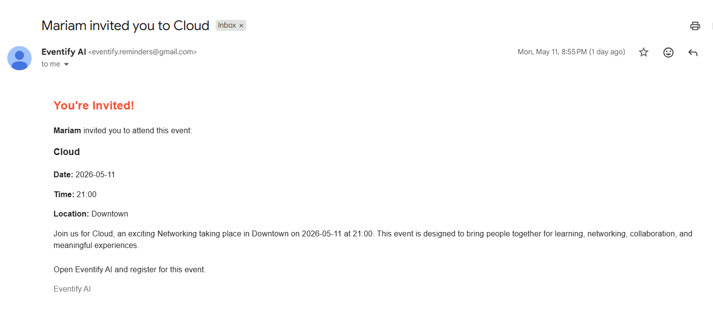
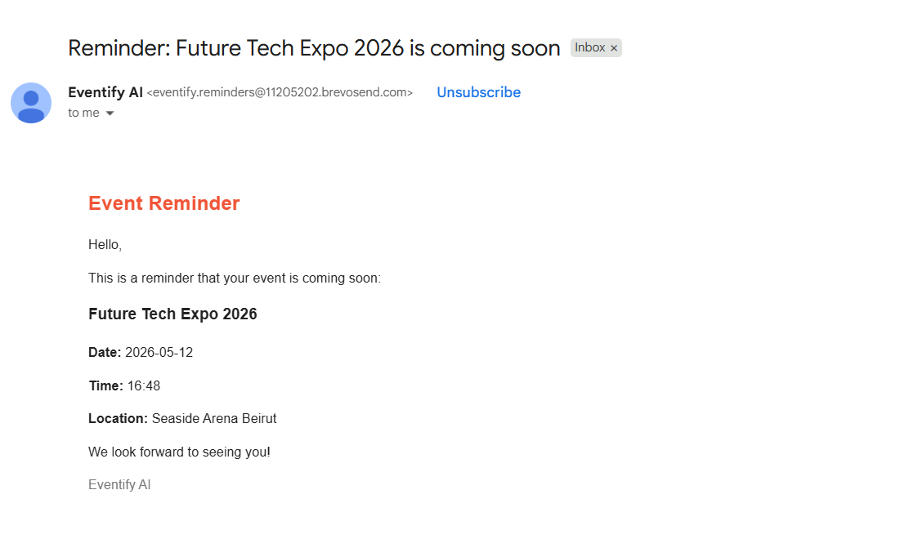

# ✨ Eventify AI – Event Scheduler Application

A modern AI-powered event scheduling and management web application built using the MERN Stack.  
Eventify AI allows users to create, manage, discover, and register for events online with AI-generated descriptions, email invitations, reminder notifications, image uploads, and responsive design.

The project focuses on creating a clean, professional, user-friendly, and responsive platform for event organization and management.

---

# 🌐 Live Demo

### Eventify
https://eventify-ai-tan.vercel.app

---

# ✨ Features

## 👤 User Features

- 🔐 User authentication system (Sign Up / Login)
- 🎫 Register for event tickets
- 📩 Invitation email system
- ⏰ Automatic reminder email notifications
- 🤖 AI-generated event descriptions
- 🖼️ Event image uploads
- 🔍 Search events by:
  - Title
  - Category
  - Location
  - Description
- 📱 Fully responsive design
- 🎟️ Ticket management system
- 📌 Attendance status tracking:
  - Upcoming
  - Attending
  - Maybe
  - Declined

---

## 🎯 Event Management Features

Users can:

- ➕ Create events
- ✏️ Edit events
- ❌ Delete events
- 📍 Add locations
- 📅 Set event date and time
- 💰 Set ticket prices
- 👥 Manage available seats
- 🖼️ Upload event images
- 🧠 Generate event descriptions using AI

---

## 📧 Email Features

Powered by Brevo:

- 📩 Invitation emails
- ⏰ Reminder emails before events
- 📬 Professional email templates
- 👥 User invitation support

---

## 📧 Email Notifications

### Invitation Email



Users can invite friends to events through professional email invitations powered by Brevo.

---

### Reminder Email



Automatic reminder emails are sent before upcoming events to notify registered users.

## 🤖 AI Features

TThe application includes an AI-inspired smart description generator that automatically creates professional event descriptions based on user input such as:
- Event title
- Category
- Location
- Date and time

This feature helps users quickly generate engaging and organized event content during event creation.

---

## 🖼️ Image Hosting

Event images are uploaded and permanently hosted using ImageKit CDN.

---

# 🛠️ Technologies Used

## Frontend

- React.js
- React Router DOM
- JavaScript (ES6+)
- CSS3
- React Icons

---

## Backend

- Node.js
- Express.js
- MongoDB Atlas
- Mongoose
- JWT Authentication
- Node Cron

---

## External Services & Platforms

### Deployment

- ▲ Vercel → Frontend Hosting
- Render → Backend Hosting

### Database

- MongoDB Atlas

### Emails

- Brevo Email API

### Image Hosting

- ImageKit CDN

---

# 📂 Project Structure

```txt
EVENT-SCHEDULER
│
├── Backend
│   │
│   ├── Config
│   │   ├── Config.js
│   │   ├──imagekit.js
│   │
│   ├── Controllers
│   │   ├── eventController.js
│   │   ├── registrationController.js
│   │   └── userController.js
│   │
│   ├── Models
│   │   ├── eventModel.js
│   │   ├── registrationModel.js
│   │   └── userModel.js
│   │
│   ├── Routes
│   │   ├── aiRoute.js
│   │   ├── eventRoute.js
│   │   ├── inviteRoute.js
│   │   ├── registrationRoute.js
│   │   └── userRoute.js
│   │
│   ├── Services
│   │   ├── emailService.js
│   │   ├── eventService.js
│   │   ├── RegistrationService.js
│   │   ├── reminderService.js
│   │   └── userService.js
│   │
│   ├── Validators
│   │   ├── eventValidation.js
│   │   └── userValidation.js
│   │
│   ├──.env
│   ├──uploads
│   └── app.js
│
├── Event-Scheduler
│   │
│   ├── src
│   │   │
│   │   ├── Components
│   │   │   ├── AllEvents
│   │   │   ├── CreateEvent
│   │   │   ├── EventCategories
│   │   │   ├── EventDetails
│   │   │   ├── Events
│   │   │   ├── Header
│   │   │   ├── HelpCenter
│   │   │   ├── Hero
│   │   │   ├── Myevents
│   │   │   ├── MyTickets
│   │   │   └── Signing
│   │   │
│   │   ├── Pages
│   │   │   ├── AllEventsPage.jsx
│   │   │   ├── CreateEventPage.jsx
│   │   │   ├── EventDetailsPage.jsx
│   │   │   ├── HelpCenterPage.jsx
│   │   │   ├── HomePage.jsx
│   │   │   ├── MyeventsPage.jsx
│   │   │   ├── MyTicketsPage.jsx
│   │   │   └── SigningPage.jsx
│   │   ├── App.js
│   │   └── index.js
│
├── package.json
├── package-lock.json
└── README.md
```
# 🚀 Getting Started

## Clone Repository

```bash
git clone https://github.com/mariamkashmar/eventify-ai
```

---

# ⚙️ Backend Setup

Navigate to backend folder:

```bash
cd Backend
```

Install dependencies:

```bash
npm install
```

Create `.env` file:

```env
Create a `.env` file inside the Backend folder by following the structure provided in the included `.env.example` file.

All required environment variables and configuration examples are already provided there.
```

Run backend server:

```bash
node app.js
```

Backend runs on:

```txt
http://localhost:5000
```

---

# 💻 Frontend Setup

Navigate to Event-Scheduler folder:

```bash
cd Event-Scheduler
```

Install dependencies:

```bash
npm install
```

Run frontend:

```bash
npm run dev
```

Frontend runs on:

```txt
http://localhost:5173
```

---

# 📸 Website Pages

The application includes several main sections:

- 🏠 Home Page
- 🎫 Events Page
- 📋 Event Details Page
- ➕ Create Event Page
- 🎟️ My Tickets Page
- 🗂️ My Events Page
- 🔐 Login / Register Pages
- 📩 Invitation System
- 🔍 Search System

---

# 📱 Responsive Design

The website is fully responsive and optimized for:

- Desktop
- Tablet
- Mobile devices

---

# 🔔 Extra Features

- 📧 Automatic email reminders
- 📩 Invitation email system
- 🤖 Smart event description generation
- 🖼️ Cloud image hosting
- 📱 Mobile responsive interface
- 🎨 Professional Eventbrite-inspired UI
- 🔍 Smart search functionality

---

# 🧠 AI Usage

This project was developed using AI-assisted tools for:
- UI/UX improvements
- Code generation assistance
- Backend integration support
- Deployment optimization
- Smart automated text generation features

---

# 💡 Future Improvements

- 💳 Online payment integration
- 📅 Google Calendar integration
- 🔔 Real-time notifications
- 📊 Event analytics dashboard
- 👥 Social media sharing
- 🌍 Multi-language support

---

# 👩‍💻 Author

Developed by Mariam Kashmar.

---

# ⭐ Repository

If you like this project, feel free to star the repository.

GitHub Repository:
https://github.com/mariamkashmar/eventify-ai
